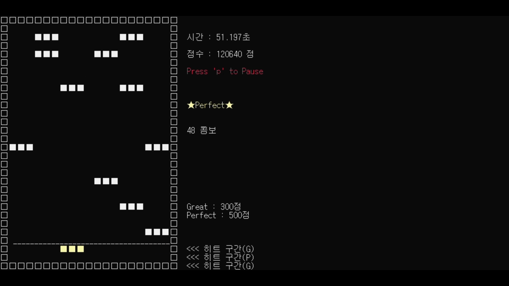

# [C++] Rhythm Dance - 콘솔 기반 리듬 게임 🎹

 

## 📖 프로젝트 소개
- **팀 이름 :** Vision(비전)
- **프로젝트명 :** Rhythm Dance - C++ 콘솔 기반 리듬 게임
- **프로젝트 기간 :** 2023-03-08 ~ 2023-06-07
- **프로젝트 형태 :** [2학년 1학기 - 객체지향 프로그래밍 1] 전공과목 팀 프로젝트
- **프로젝트 설명**
  - 노트가 내려오면 멜로디와 박자에 맞춰 키보드의 6개 키를 눌러서 플레이하는 C++ 콘솔 기반의 리듬 게임입니다.
  - `IVE - I AM` 음악을 기반으로 멜로디와 박자에 맞게 노트가 구성되어 있습니다.
  - FMOD 사운드 라이브러리를 사용하여 리듬 게임의 BGM을 재생합니다.

 

## 🗂️ 목차

1. [개발 목표 및 출시 배경](#1--개발-목표-및-출시-배경)
2. [개발 환경](#2-%EF%B8%8F-개발-환경)
3. [사용 기술 스택](#3--사용-기술-스택)
4. [개발 기간](#4--개발-기간)
5. [개발 중점 사항](#5--개발-중점-사항)
6. [협업 및 형상관리](#6-%EF%B8%8F-협업-및-형상관리)
7. [프로젝트 성과 및 느낀점](#7--프로젝트-성과-및-느낀점)
8. [게임 시연 모습](#8--게임-시연-모습)

 

## 1. 💡 개발 목표 및 출시 배경

- **개발 목표 :** C++ 객체지향의 특성을 활용하면서, 음악의 멜로디와 박자에 맞춰서 키를 누르는 리듬 게임을 개발하는 것입니다.

 

## 2. 🛠️ 개발 환경

- **개발 언어 :** C, C++
- **라이브러리 :** FMOD Sound Library
- **IDE :** Microsoft Visual Studio Community 2022
- **버전 및 형상 관리 :** GitHub Desktop

 

## 3. 📚 사용 기술 스택

- ### C++
  - 클래스와 객체
  - 캡슐화 및 정보 은닉

- ### FMOD Sound Library
  - FMOD 라이브러리를 통한 리듬 게임의 BGM 재생
  - GoF 디자인 패턴 : 생성 패턴 - 싱글톤 패턴

 

## 4. 📆 개발 기간

- 프로젝트 기획, 분석, 설계 : 2023-03-08 ~ 2023-04-05
- 프로젝트 개발 : 2023-04-05 ~ 2023-06-06
- 테스트 : 2023-05-31 ~ 2023-06-06
- 최종 발표 : 2023-06-07

 

## 5. 🎯 개발 중점 사항

- 다음과 같은 C++ 객체지향의 특성이 활용되도록 개발하였습니다.
  - 클래스와 객체
  - 캡슐화 및 정보 은닉
- FMOD 사운드 라이브러리에 싱글톤 패턴이 적용되었습니다.
- 회의를 진행하여 진척 사항을 공유하고 피드백하고, 회의록을 작성하면서 **진척 관리**가 이루어질 수 있도록 하였습니다.
- GitHub를 통하여 팀원 간의 협업 및 소스 코드의 버전을 관리하여 **형상 관리**가 이루어질 수 있도록 하였습니다.
- 개발 과정에서 어려움 또는 오류가 발생할 시 팀원 간 서로 **협력하여 해결**하는 과정을 가질 수 있도록 하였습니다.

 

## 6. 🗃️ 협업 및 형상관리

- **GitHub를 통한 협업 :** 각 팀원이 개발 및 작업한 소스 코드를 본 GitHub 저장소에서 Pull Request 생성하고, 검토 및 승인 후 Merge(병합)하는 방식으로 협업을 진행하였습니다.
- **형상 관리 :** 소스 코드의 버전 관리는 GitHub를 통해 Commit 내역으로 관리되도록 하여 **형상 관리**를 진행하였습니다.

 

## 7. 📊 프로젝트 성과 및 느낀점

- C++의 클래스와 객체, 캡슐화 및 정보 은닉의 특성을 소스 코드로 직접 구현하며 이해할 수 있었습니다.
  - private로 접근이 제한된 필드 및 메서드는 이를 접근하기 위한 public 메서드를 통해서 접근할 수 있습니다.
- C++에서 싱글톤 패턴을 구현하는 방법을 습득하게 되었습니다.
  - 클래스에서 생성자의 접근 제한자를 private로 지정하여, 해당 클래스의 객체를 한 번만 생성하고 이를 공유하여 사용할 수 있도록 하는 것입니다.
- Visual Studio에서 외부 라이브러리를 사용하는 방법을 습득하게 되었습니다.
  - FMOD 사운드 라이브러리를 사용하기 위해 프로젝트 설정의 포함 디렉터리, 라이브러리 디렉터리 설정을 변경해야 합니다.
- 전공과목에서 팀 프로젝트를 처음 진행하는 것이어서 조금 미흡하지만, 다음 프로젝트에서는 아래의 사항을 조금 더 보완하여 진행하면 좋을 것 같다는 생각이 들었습니다.
  - WBS를 통한 진척관리
  - 테스트 케이스를 통한 품질관리

 

## 8. 📸 게임 시연 모습

<table>
  <tr>
    <td align="center">
       
      메인 화면
    </td>
    <td align="center">
       
      게임 시작 전 준비 화면
    </td>
  </tr>
  <tr>
    <td align="center">
       
      게임 진행 화면 1
    </td>
    <td align="center">
       
      게임 진행 화면 2
    </td>
  </tr>
  <tr>
    <td align="center">
       
      노트 싱크 조절 메뉴
    </td>
    <td align="center">
       
      게임 종료 화면
    </td>
  </tr>
</table>
